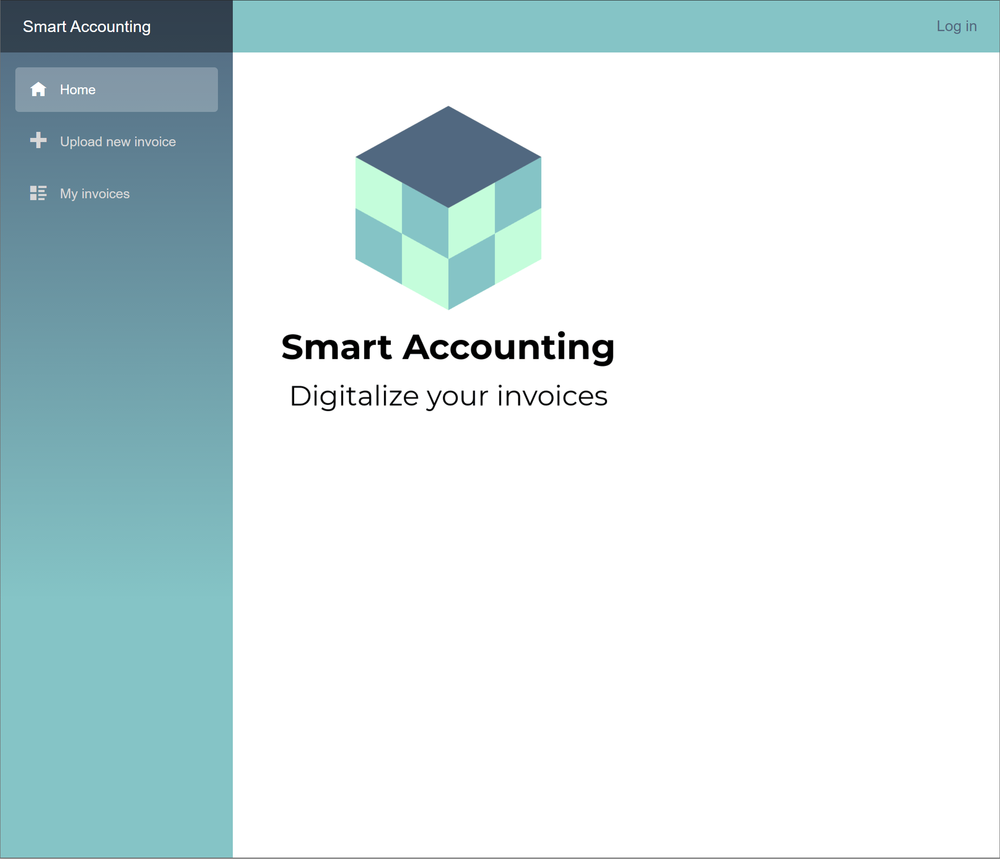
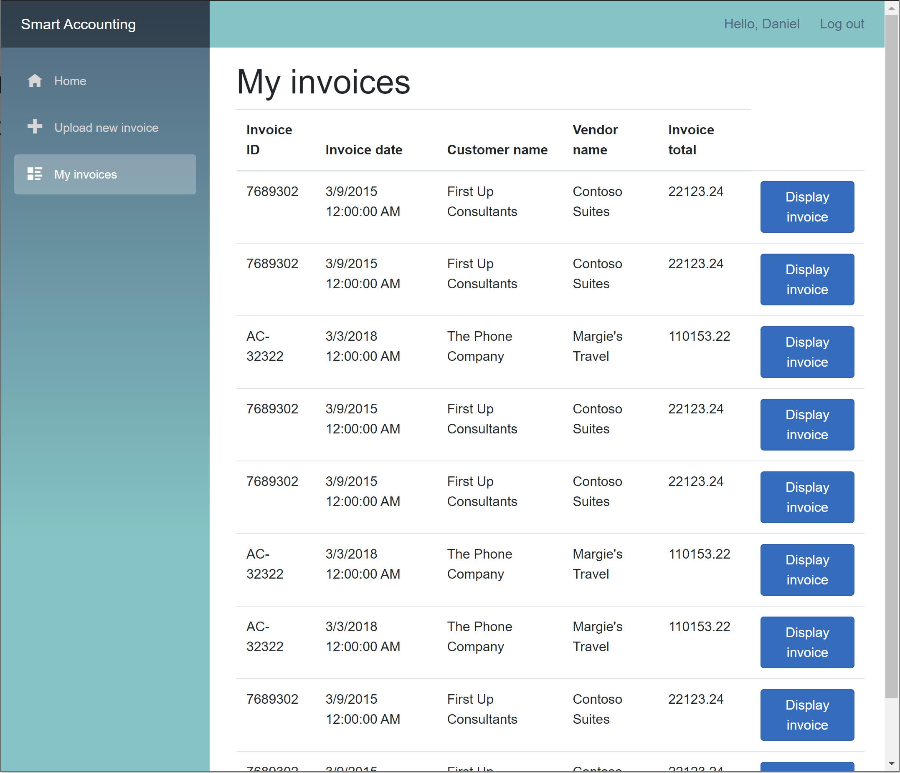
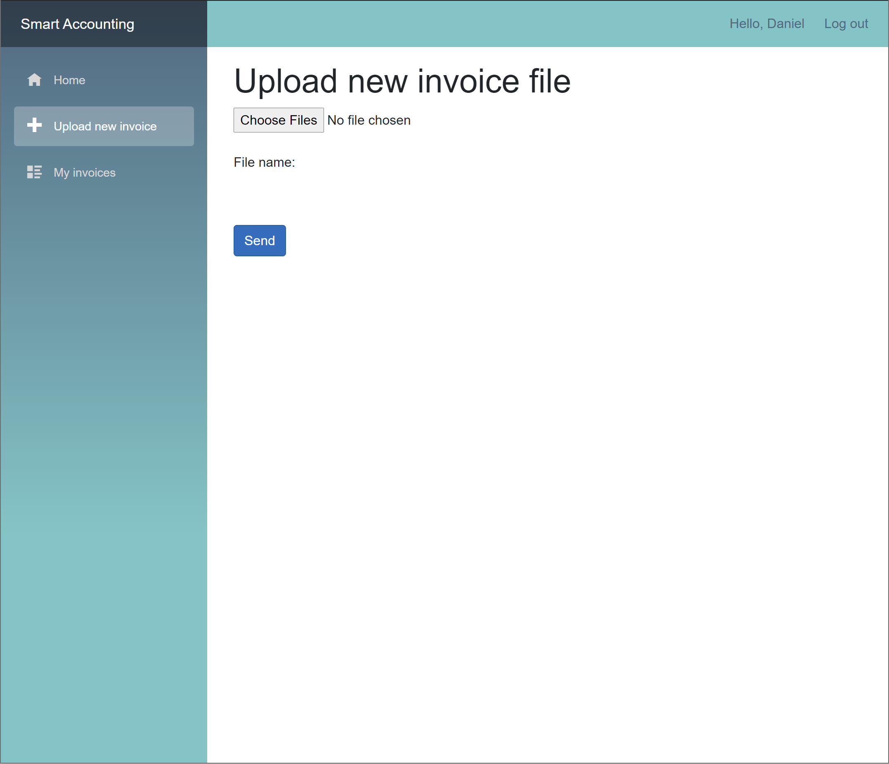
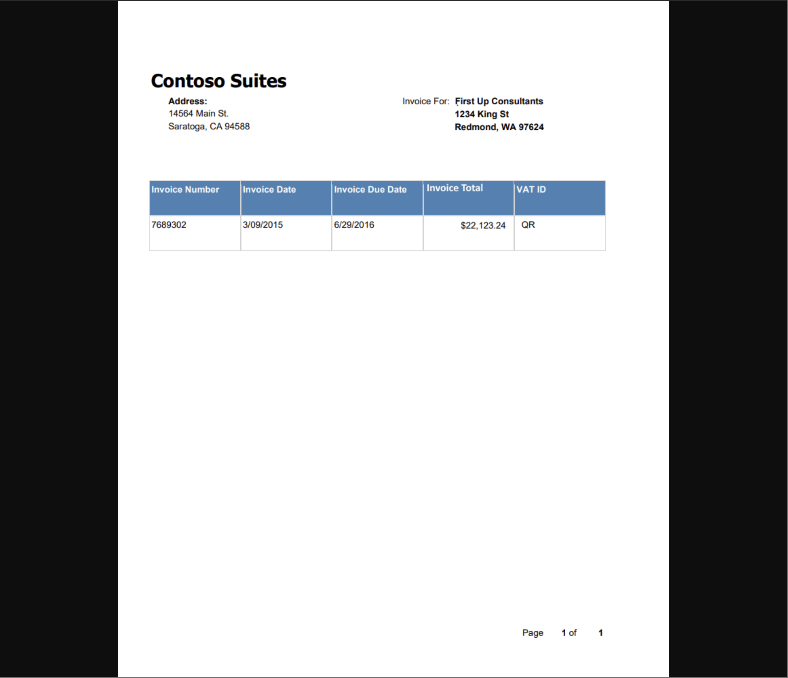
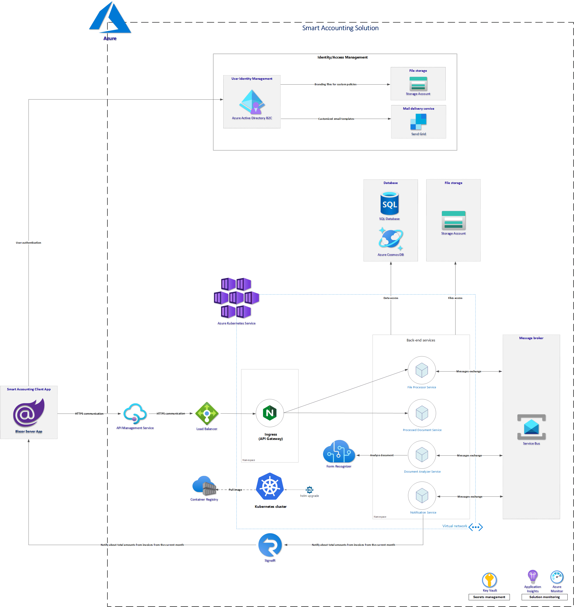

# Smart-Accounting

Smart Accounting is a solution for collecting invoices in a digital way.










## Disclaimer

I published this project to help others implement microservice solutions using Microsoft Azure cloud services. I am aware that there is no step-by-step instruction how to setup every component. I published this repository mainly to show some concepts around integration with Azure cloud services. In the future I plan to organize some live sessions or create videos on my YouTube channel where I will explain implementation details.


## Solution architecture




## Solution components and functionalities

### [File Processor microservice](https://github.com/Daniel-Krzyczkowski/Smart-Accounting/tree/main/src/smart-accounting-backend-services/src/FileProcessor/SmartAccounting.FileProcessor.API)

Microservice responsible for handling file upload, written. User can upload scanned invoice to be processed by the system. Uploaded files are stored on the Azure Blob Storage. There is also initial record created in the Azure Cosmos DB with details about the file (file name, file URI on the Azure Blob Storage). Once the file is saved, there is new event published to the Azure Service Bus topic. Microservice is written using ASP .NET Core .NET 5 Web API.


### [Document Analyzer microservice](https://github.com/Daniel-Krzyczkowski/Smart-Accounting/tree/main/src/smart-accounting-backend-services/src/DocumentAnalyzer/SmartAccounting.DocumentAnalyzer.API)

Microservice responsible for analyzing uploaded invoice files using Form Recognizer service. It receives the event about new file uploaded to the Azure Blob Storage. Once the invoice is scanned, details returned from the Form Recognizer are saved to in the Azure CosmosDB. Once the process is completed, there is new event published to the Azure Service Bus topic. Microservice is written using ASP .NET Core .NET 5 Web API.


### [Processed Document microservice](https://github.com/Daniel-Krzyczkowski/Smart-Accounting/tree/main/src/smart-accounting-backend-services/src/ProcessedDocument/SmartAccounting.ProcessedDocument.API)

Processed documents can be accessed using this microservice. Details about invoices are stored in the Azure CosmosDB, and scanned files are stored on the Azure Blob Storage. Microservice is written using ASP .NET Core .NET 5 Web API.


### [Notification microservice](https://github.com/Daniel-Krzyczkowski/Smart-Accounting/tree/main/src/smart-accounting-backend-services/src/Notification/SmartAccounting.Notification.API)

Notification service is used to notify users about the scan result in the real time. Once all details are saved in the database by the Document Analyzer microservice , Notification microservice is notified, and publishes new event using Azure SignalR Service to the application. Microservice is written using ASP .NET Core .NET 5 Web API.

### [Smart Accounting Web App](https://github.com/Daniel-Krzyczkowski/Smart-Accounting/tree/main/src/smart-accounting-web-app)

Web application for end users written with Blazor. Users can authenticate and upload invoice files. They can also display already scanned invoices data and display originally uploaded files.


# Infrastructure configuration

This section contains some helpful hints about the infrastructure setup.

## Azure Kubernetes Service setup

### Create Azure Kubernetes Service

Use commands from [this documentation](https://docs.microsoft.com/en-us/azure/aks/use-azure-ad-pod-identity) to create AKS cluster with pod-managed identities enabled.

### Set current subscription:

`az account set --subscription <<subscription ID>>`

### Register the EnablePodIdentityPreview

`az feature register --name EnablePodIdentityPreview --namespace Microsoft.ContainerService`

### Install the aks-preview Azure CLI


```
# Install the aks-preview extension
az extension add --name aks-preview

# Update the extension to make sure you have the latest version installed
az extension update --name aks-preview
```


### Create AKS cluster:

`az aks create -g rg-smart-accounting -n aks-smart-accounting --enable-pod-identity --network-plugin azure --node-count 3`


### Create an identity

Create an identity using az identity create and set the IDENTITY_CLIENT_ID and IDENTITY_RESOURCE_ID variables.


```
export IDENTITY_RESOURCE_GROUP="rg-smart-accounting"
export IDENTITY_NAME="aks-pods-identity"
az identity create --resource-group ${IDENTITY_RESOURCE_GROUP} --name ${IDENTITY_NAME}
export IDENTITY_CLIENT_ID="$(az identity show -g ${IDENTITY_RESOURCE_GROUP} -n ${IDENTITY_NAME} --query clientId -otsv)"
export IDENTITY_RESOURCE_ID="$(az identity show -g ${IDENTITY_RESOURCE_GROUP} -n ${IDENTITY_NAME} --query id -otsv)"
```

### Assign permissions for the managed identity

The IDENTITY_CLIENT_ID managed identity must have Reader permissions in the resource group that contains the virtual machine scale set of your AKS cluster.

```
NODE_GROUP=$(az aks show -g rg-smart-accounting -n aks-smart-accounting --query nodeResourceGroup -o tsv)
NODES_RESOURCE_ID=$(az group show -n $NODE_GROUP -o tsv --query "id")
az role assignment create --role "Reader" --assignee "$IDENTITY_CLIENT_ID" --scope $NODES_RESOURCE_ID
```

### Create a pod identity

Create a pod identity for the cluster using az aks pod-identity add.

```
export POD_IDENTITY_NAME="aks-pods-identity"
export POD_IDENTITY_NAMESPACE="dev-smart-accounting-services"
az aks pod-identity add --resource-group rg-smart-accounting --cluster-name aks-smart-accounting --namespace ${POD_IDENTITY_NAMESPACE}  --name ${POD_IDENTITY_NAME} --identity-resource-id ${IDENTITY_RESOURCE_ID}
```

### Install Secrets Store CSI Driver and Azure Key Vault Provider 

https://azure.github.io/secrets-store-csi-driver-provider-azure/getting-started/installation/#deployment-using-helm

### Apply secret-provider-class.yml

https://dev.azure.com/techmindfactory/Smart%20Accounting/_git/smart-accounting-infrastructure?path=%2Fsrc%2Faks-config%2Fsecret-provider-class.yml

### Create static IP address

https://docs.microsoft.com/en-us/azure/aks/ingress-static-ip

`az aks show --resource-group rg-smart-accounting --name aks-smart-accounting --query nodeResourceGroup -o tsv`

This will produce the output: 
`MC_rg-smart-accounting_aks-smart-accounting_westeurope`


`az network public-ip create --resource-group MC_rg-smart-accounting_aks-smart-accounting_westeurope --name ip-public-aks-smart-accounting --sku Standard --allocation-method static --query publicIp.ipAddress -o tsv`


### Setup NGINX ingress

`helm repo add ingress-nginx https://kubernetes.github.io/ingress-nginx`

Create *ingress-basic* namespace:

```
---
apiVersion: v1
kind: Namespace
metadata:
  name: ingress-basic
```


```
# Use Helm to deploy an NGINX ingress controller
helm install nginx-ingress ingress-nginx/ingress-nginx \
    --namespace ingress-basic \
    --set controller.replicaCount=2 \
    --set controller.nodeSelector."beta\.kubernetes\.io/os"=linux \
    --set defaultBackend.nodeSelector."beta\.kubernetes\.io/os"=linux \
    --set controller.admissionWebhooks.patch.nodeSelector."beta\.kubernetes\.io/os"=linux \
    --set controller.service.loadBalancerIP="20.71.249.116" \
    --set controller.service.annotations."service\.beta\.kubernetes\.io/azure-dns-label-name"="smart-accounting"
```

This will be displayed after few seconds:

```
NAME: nginx-ingress
LAST DEPLOYED: Sat May  8 17:17:49 2021
NAMESPACE: ingress-basic
STATUS: deployed
REVISION: 1
TEST SUITE: None
NOTES:
The ingress-nginx controller has been installed.
It may take a few minutes for the LoadBalancer IP to be available.
You can watch the status by running 'kubectl --namespace ingress-basic get services -o wide -w nginx-ingress-ingress-nginx-controller'
```

To verify, use below command:

`kubectl --namespace ingress-basic get services -o wide -w nginx-ingress-ingress-nginx-controller`

Below result will be displayed:

```
NAME                                     TYPE           CLUSTER-IP    EXTERNAL-IP     PORT(S)                      AGE     SELECTOR
nginx-ingress-ingress-nginx-controller   LoadBalancer   10.0.184.12   40.118.69.171   80:30773/TCP,443:31349/TCP   2m44s   app.kubernetes.io/component=controller,app.kubernetes.io/instance=nginx-ingress,app.kubernetes.io/name=ingress-nginx
```

### Setup SSL Certificate

https://docs.microsoft.com/en-us/azure/aks/ingress-static-ip

Remember to call `kubectl apply -f certificates.yml` with `--validate=false`

### Access Azure Container Registry

az aks update -n aks-smart-accounting -g rg-smart-accounting --attach-acr acrsmartaccounting

### Enable access for AKS VNET in the Azure SQL Firewall settings in the Azure portal


## Azure services setup


### Set current subscription:

`az account set --subscription <<subscription ID>>`

### Create resources with Bicep:

#### Create resource group:

`az group create --location westeurope --name rg-smart-accounting-dev`

#### Create [_smart-accounting-infrastructure.bicep_](https://github.com/Daniel-Krzyczkowski/Smart-Accounting/blob/main/src/smart-accounting-infrastructure/azure-services-config/smart-accounting-infrastructure.bicep) file:


#### Deploy template using below command using Azure CLI:


```
today=$(date +"%d-%b-%Y")
DeploymentName="deployment-"$today

az deployment group create \
  --name $DeploymentName \
  --resource-group rg-smart-accounting-dev \
  --template-file smart-accounting-infrastructure.bicep \
  --parameters location=westeurope tenantId=your-tenant-id publisherName='Tech Mind Factory' publisherEmail=youremail@email.com
```
