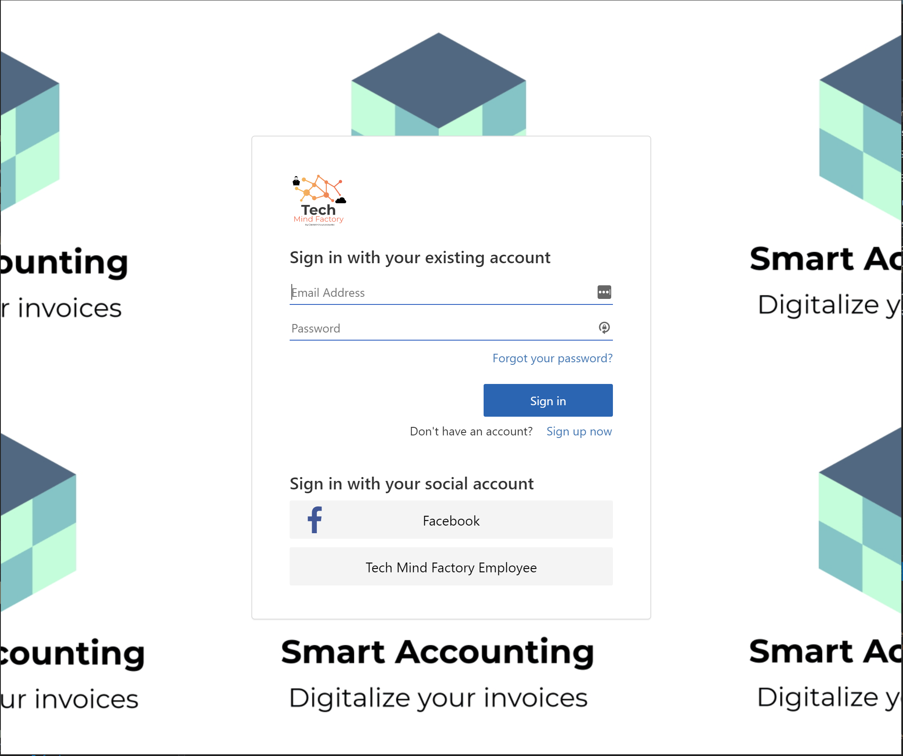
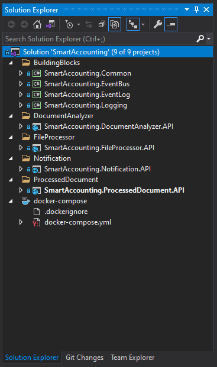
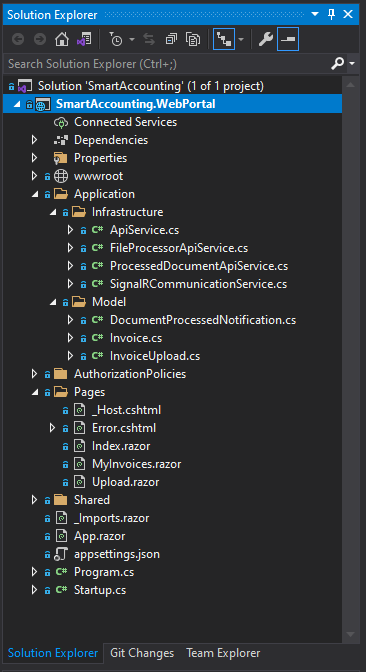
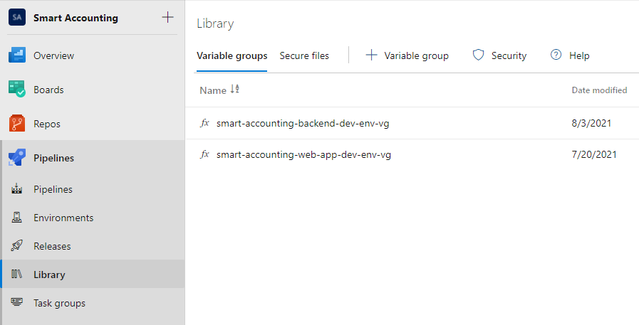
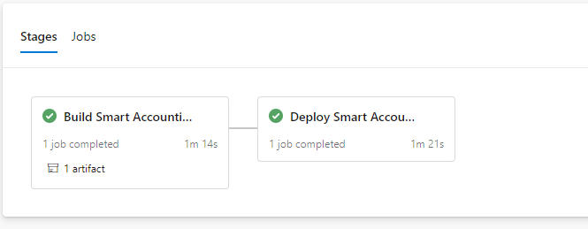
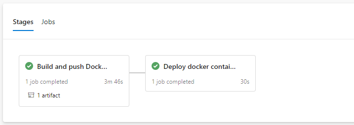

# Smart-Accounting

Smart Accounting is dedicated solution created for invoices digitalization. Users use web application (Blazor) to upload photos of their invoices. Then, invoice is saved on the Azure Storage Account. After few seconds, invoice is scanned using Azure Form Recognizer, and details from the invoice are saved in the database (Azure Cosmos DB). User can display all details in the web application. This will help users to collect the invoices in one place, searching for specific invoice, and counting different amounts from these invoices. Users can display uploaded photo of the invoice from the invoices library in the web application. This eliminates the problem of storing paper copies of each invoice and makes it easier to find specific invoices.





*If you like this content, please give it a star!*


## Disclaimer

In this solution I decided to use Azure Kubernetes Service (AKS) to host microservices. Please note that the same solutuion could be built with serverless architecture (using Azure Functions). I just wanted to see Kubernetes in action and improve my skills around Kubernetes/Docker technologies.

You could also use Azure Web Apps to host these microservices.

* I published this project to help others implement microservice solutions using Microsoft Azure cloud services. I am aware that there is no step-by-step instruction how to setup every component. I published this repository mainly to show some concepts around integration with Azure cloud services. Below you can find extended explanation about the solution structure and configuration.

* SignalR integration in the Web App source code is not completed yet. There is an issue with authorization - once I solve it out I will publish required changes.

* Azure AD B2C configuration was used basing on the [Lost-In-Azure-Cloud-Identity](https://github.com/Daniel-Krzyczkowski/Lost-In-Azure-Cloud-Identity) project. There you can find custom policies files with branding files.

# Solution architecture

Below diagram presents solution architecture and Azure services I used. Please remember that some integrations are simplified (like keeping appropriate security level).


Let's discuss the purpose of each service used in the above architecture.

## Azure Kubernetes Service (AKS)

Backend microservices are hosted in the Kubernetes cluster in the Azure cloud. Kubernetes is responsible for creating these services and managing their state. If any of these microservices is broken, Kubernetes will re-create it. Below I explained four microservices I developed in this solution:

### File Processor microservice

Microservice responsible for handling file upload. User can upload scanned invoice to be processed by the system. Uploaded files are stored on the Azure Blob Storage. There is also initial record created in the Azure Cosmos DB with details about the file (file name, file URI on the Azure Blob Storage). Once the file is saved, there is new event published to the Azure Service Bus topic.


### Document Analyzer microservice

Microservice responsible for analyzing uploaded invoice files using Form Recognizer service. It receives the event about new file uploaded to the Azure Blob Storage. Once the invoice is scanned, details returned from the Form Recognizer are saved to in the Azure CosmosDB. Once the process is completed, there is new event published to the Azure Service Bus topic.


### Processed Document microservice

Processed documents can be accessed using this microservice. Details about invoices are stored in the Azure CosmosDB, and scanned files are stored on the Azure Blob Storage.


### Notification microservice

Notification service is used to notify users about the scan result in the real time. Once all details are saved in the database by the Document Analyzer microservice , Notification microservice is notified, and publishes new event using Azure SignalR Service to the application.

## Azure Containers Registry

Aaa


## Azure Web App

Azure Web App is used to host Blazor server web application accessed by users.

### Smart Accounting web app

Smart Accounting web application was created for end users. Users can register and sign in to upload their invoices and see scanning results.

## Azure Active Directory B2C (Azure AD B2C)

Azure Active Directory B2C is an identity service in the Azure cloud that enables user authentication and management. Implementing own identity service can be challenging. Try to think about data storage, secure connections, or token generation and validation. With Azure AD B2C, adding user authentication is much easier. In the Smart Accounting solution users can create accounts and login to access some of the functionalities. What is more - with Azure AD B2C, login, registration, password reset, or profile edit pages can be customized and branded (like with the company logo or background). You do not have to implement login, or registration views yourself.


## Azure Storage Account

Azure Storage Account is one of the oldest services available in the Azure cloud. It provides an easy way to store different kind of files using Blob Storage. In the Smart Accounting solution, it is used to store invoice files uploaded by users.


## Azure SendGrid

Azure SendGrid service enables sending customized emails. It is great because we can create email templates but also it provides SDK that we can use to implement emails sending in the source code. In the Smart Accounting solution it is used to send emails with verification codes when user registers using Azure AD B2C identity service.


## Azure Cosmos DB

Azure Cosmos DB is a globally distributed database available in the Azure cloud. User invoice data is stored in this database in the Smart Accounting solution.


## Azure SQL Database

Azure SQL is relational database. In the Smart Accounting solution it is used to store logs about events, like successfully processed invoices.


## Azure API Management

Azure API Management is a service that works as a gateway to different APIs behind it. With Azure API Management you can secure your APIs. It provides a different kind of policies so for instance we can implement throttling or validate tokens. In the Smart Accounting solution, it was used to protect access to backend microservices hosted in the Kubernetes cluster.


## Azure Form Recognizer

Azure Form Recognizer is a part of Azure Applied AI Services that enables building automated data processing software using machine learning technology. With this service we can Identify and extract text, key/value pairs, selection marks, tables, and structure from the scanned documents. In the Smart Accounting solution it was used to scan invoices and extract data so it can be stored in the Azure Cosmos DB.


## Azure SignalR Service

Azure SignalR Service simplifies the process of adding real-time web functionality to applications over HTTP. As a result, clients are updated without the need to poll the server, or submit new HTTP requests for updates. In the Smart Accounting it is used to send real-time notifications to Smart Accounting web application once invoice file is processed successfully.


## Azure Service Bus

Azure Service Bus service is a cloud messaging service. With Azure Service Bus we can build reliable and elastic cloud apps with messaging. In the Smart Accounting solution, Azure Service Bus topics and subscriptions were used to exchange information about events between microservices. Using Azure Service Bus enables building loosely-coupled microservices.


## Azure Key Vault

Security is a very important aspect of every project. Secrets and credentials should be stored in the secure store. This is why Azure Key Vault is used in the Smart Accounting solution. Parameters like connection string to the database or storage key are stored in the Azure Key Vault instance.


## Azure Application Insights

Tracking issues in cloud solutions can be challenging. Collecting logs and detecting bugs can be hard. This is why it is good to use an Application Performance Management service like Azure Application Insights. With this Azure cloud service, we can log all events and errors that occure in our solution. Azure Application Insights provides SDKs in many languages (like C# oraz Java) so we can easily integrate them with our application. All logs are then available in the Azure portal, where rich dashboards are displayed with collected log data.


## Azure Monitor

Azure Monitor delivers a comprehensive solution for collecting, analyzing, and acting on telemetry from cloud and on-premises environments. In the Smart Accounting solution, Azure Monitor is used to monitor Kubernetes cluster performance, and as mentioned above, Application Insights service (which is the part of Azure Monitor) is integrated with microservices (using .NET C# SDK).


# Backend microservices - project structure

## .NET microservices

In this section I would like to discuss backend solution structure in the Visual Studio. You can find the source code in the *src* folder inside [*smart-accounting-backend-services*](https://github.com/Daniel-Krzyczkowski/Smart-Accounting/tree/main/src/smart-accounting-backend-services/src) folder.



Let's discuss the above solution structure and projects which it includes.

### BuildingBlocks folder

*BuildingBlocks* folder contains fours projects:

1. **SmartAccounting.Common** - contains commonly used classed like API exception handler or common response structure
2. **SmartAccounting.EventBus** - contains components used to iplmement asynchronous communication amond microservices using Azure Service Bus 
3. **SmartAccounting.EventLog** - contains components used to implement event history persistence (like storing successfully processed invoice file)
4. **SmartAccounting.Logging** - contains components used to implement logging with Azure Application Insights

### [File Processor microservice](https://github.com/Daniel-Krzyczkowski/Smart-Accounting/tree/main/src/smart-accounting-backend-services/src/FileProcessor/SmartAccounting.FileProcessor.API)

Microservice responsible for handling file upload, written. User can upload scanned invoice to be processed by the system. Uploaded files are stored on the Azure Blob Storage. There is also initial record created in the Azure Cosmos DB with details about the file (file name, file URI on the Azure Blob Storage). Once the file is saved, there is new event published to the Azure Service Bus topic. Microservice is written using ASP .NET Core .NET 5 Web API.


### [Document Analyzer microservice](https://github.com/Daniel-Krzyczkowski/Smart-Accounting/tree/main/src/smart-accounting-backend-services/src/DocumentAnalyzer/SmartAccounting.DocumentAnalyzer.API)

Microservice responsible for analyzing uploaded invoice files using Form Recognizer service. It receives the event about new file uploaded to the Azure Blob Storage. Once the invoice is scanned, details returned from the Form Recognizer are saved to in the Azure CosmosDB. Once the process is completed, there is new event published to the Azure Service Bus topic. Microservice is written using ASP .NET Core .NET 5 Web API.


### [Processed Document microservice](https://github.com/Daniel-Krzyczkowski/Smart-Accounting/tree/main/src/smart-accounting-backend-services/src/ProcessedDocument/SmartAccounting.ProcessedDocument.API)

Processed documents can be accessed using this microservice. Details about invoices are stored in the Azure CosmosDB, and scanned files are stored on the Azure Blob Storage. Microservice is written using ASP .NET Core .NET 5 Web API.


### [Notification microservice](https://github.com/Daniel-Krzyczkowski/Smart-Accounting/tree/main/src/smart-accounting-backend-services/src/Notification/SmartAccounting.Notification.API)

Notification service is used to notify users about the scan result in the real time. Once all details are saved in the database by the Document Analyzer microservice , Notification microservice is notified, and publishes new event using Azure SignalR Service to the application. Microservice is written using ASP .NET Core .NET 5 Web API.

### [Smart Accounting Web App](https://github.com/Daniel-Krzyczkowski/Smart-Accounting/tree/main/src/smart-accounting-web-app)

Web application for end users written with Blazor. Users can authenticate and upload invoice files. They can also display already scanned invoices data and display originally uploaded files.

Microservice developed with the ASP .NET 5 Core Web API. This microservice provides endpoints to get specific user invoice data or all invoices for specific user.

## docker-compose

Docker compose file is used to build Docker images with all microservices mentioned above. This file also helps running all microservices together on the local development. Compose is a tool for defining and running multi-container Docker applications. With Compose, you use a YAML file to configure your application’s services. Then, with a single command, you create and start all the services from your configuration machine.

Here is *docker-compose.yml* file content from the Smart Accounting solution:

```yml
version: '3.4'

services:
  documentanalyzer.api:
    image: ${DOCKER_REGISTRY-}documentanalyzerapi
    build:
      context: .
      dockerfile: DocumentAnalyzer/SmartAccounting.DocumentAnalyzer.API/Dockerfile


  fileprocessor.api:
    image: ${DOCKER_REGISTRY-}fileprocessorapi
    build:
      context: .
      dockerfile: FileProcessor/SmartAccounting.FileProcessor.API/Dockerfile


  notification.api:
    image: ${DOCKER_REGISTRY-}notificationapi
    build:
      context: .
      dockerfile: Notification/SmartAccounting.Notification.API/Dockerfile


  processeddocument.api:
    image: ${DOCKER_REGISTRY-}processeddocumentapi
    build:
      context: .
      dockerfile: ProcessedDocument/SmartAccounting.ProcessedDocument.API/Dockerfile

```

As you can see, each microservice is built using *Dockerfile*. A Dockerfile is a text document that contains all the commands a user could call on the command line to assemble an image. Here is [*Dockerfile*](https://github.com/Daniel-Krzyczkowski/Smart-Accounting/blob/main/src/smart-accounting-backend-services/src/DocumentAnalyzer/SmartAccounting.DocumentAnalyzer.API/Dockerfile) for the Document Analyzer microservice:

```yml
FROM mcr.microsoft.com/dotnet/aspnet:5.0 AS base
WORKDIR /app
EXPOSE 80

FROM mcr.microsoft.com/dotnet/sdk:5.0 AS build
WORKDIR /src
COPY ["DocumentAnalyzer/SmartAccounting.DocumentAnalyzer.API/SmartAccounting.DocumentAnalyzer.API.csproj", "DocumentAnalyzer/SmartAccounting.DocumentAnalyzer.API/"]
RUN dotnet restore "DocumentAnalyzer/SmartAccounting.DocumentAnalyzer.API/SmartAccounting.DocumentAnalyzer.API.csproj"
COPY . .
WORKDIR "/src/DocumentAnalyzer/SmartAccounting.DocumentAnalyzer.API"
RUN dotnet build "SmartAccounting.DocumentAnalyzer.API.csproj" -c Release -o /app/build

FROM build AS publish
RUN dotnet publish "SmartAccounting.DocumentAnalyzer.API.csproj" -c Release -o /app/publish

FROM base AS final
WORKDIR /app
COPY --from=publish /app/publish .
ENTRYPOINT ["dotnet", "SmartAccounting.DocumentAnalyzer.API.dll"]
```

I encourage you to read more [how Visual Studio builds containerized apps](https://docs.microsoft.com/en-us/visualstudio/containers/container-build?view=vs-2019&WT.mc_id=visualstudio_containers_aka_containerfastmode).


## Kubernetes deployment files

Each backend service is deployed using Kubernetes manifests files. These files can be found in the [*kubernetes*](https://github.com/Daniel-Krzyczkowski/Smart-Accounting/tree/main/src/smart-accounting-backend-services/kubernetes) folder.


# Blazor web application - project structure

In this section I would like to discuss Blazor Web Application project structure in the Visual Studio.
You can find the source code in the [*smart-accounting-web-app*](https://github.com/Daniel-Krzyczkowski/Smart-Accounting/tree/main/src/smart-accounting-web-app) folder.



## Communication with microservices

Communication with microservices is implemented in the the [*FileProcessorApiService*](https://github.com/Daniel-Krzyczkowski/Smart-Accounting/blob/main/src/smart-accounting-web-app/src/SmartAccounting.WebPortal/Application/Infrastructure/FileProcessorApiService.cs), and [*ProcessedDocumentApiService*](https://github.com/Daniel-Krzyczkowski/Smart-Accounting/blob/main/src/smart-accounting-web-app/src/SmartAccounting.WebPortal/Application/Infrastructure/ProcessedDocumentApiService.cs) classes which derives from the abstract class called [*ApiService*](https://github.com/Daniel-Krzyczkowski/Smart-Accounting/blob/main/src/smart-accounting-web-app/src/SmartAccounting.WebPortal/Application/Infrastructure/ApiService.cs).

In the *ApiService* base class there are two methods:

* **GetAndAddApiAccessTokenToAuthorizationHeaderAsync** - method responsible for adding access token to the authorization HTTP header
* **GetAndAddApiSubscriptionKeyHeaderAsync** - method responsible for adding Azure API Management subscription key to the HTTP request

To receive real-time notifications, there is [*SignalRCommunicationService*](https://github.com/Daniel-Krzyczkowski/Smart-Accounting/blob/main/src/smart-accounting-web-app/src/SmartAccounting.WebPortal/Application/Infrastructure/SignalRCommunicationService.cs) class implemented. At the moment of writing this article there is an issue with authorization - once I solve it out I will publish required changes.

Users have to register and authenticate before they can access application's functionalities. In the [*Startup.cs*](https://github.com/Daniel-Krzyczkowski/Smart-Accounting/blob/main/src/smart-accounting-web-app/src/SmartAccounting.WebPortal/Startup.cs) class, in the [*ConfigureServices*](https://github.com/Daniel-Krzyczkowski/Smart-Accounting/blob/main/src/smart-accounting-web-app/src/SmartAccounting.WebPortal/Startup.cs#L26) method there is code responsible for handling authorization.


# Continuous Integration and Deployment in the Azure DevOps

There are pipelines created in the Azure DevOps for backend microservices and web application.

Variables are kept in the dedicated variable group in the Azure DevOps:



## Smart Accounting Web App

In the [*azure-pipelines*](https://github.com/Daniel-Krzyczkowski/Smart-Accounting/tree/main/src/smart-accounting-web-app/azure-pipelines) folder there are three YAML files:

* **azure-pipelines-build-template.yml** - this file contains steps responsible for building package with Blazor web application
* **azure-pipelines-deployment-template.yml** - this file contains steps responsible for publishing Blazor web application package to Azure Web App
* **azure-pipelines.yml** - this file contains stages with referenced template files mentioned above



## Smart Accounting microservices

In the [*azure-pipelines*](https://github.com/Daniel-Krzyczkowski/Smart-Accounting/tree/main/src/smart-accounting-backend-services/azure-pipelines) folder there are three YAML files:

* **azure-pipelines-build-template.yml** - this file contains steps responsible for building Docker images with microservices
* **azure-pipelines-deployment-template.yml** - this file contains steps responsible for getting Kubernetes deployment manifests, deploying Docker containers, and updating Ingress routes
* **azure-pipelines.yml** - this file contains stages with referenced template files mentioned above

Process of publishing microservices to Azure Kubernetes Cluster is the following:

1. Docker image is created for each backend microservice using Dockerfile
2. Docker images are pushed to the Azure Container Registry
3. Once all images are pushed to the Azure Container Registry, there is deployment triggered to start containers in the Kubernetes cluster
4. Once all microservices are pushed, Ingress routes in Kubernetes are updated to make it possible to communicate with microservices



# Infrastructure configuration

This section contains some helpful hints about the infrastructure setup.

## Azure Kubernetes Service setup

### Create Azure Kubernetes Service

Use commands from [this documentation](https://docs.microsoft.com/en-us/azure/aks/use-azure-ad-pod-identity) to create AKS cluster with pod-managed identities enabled.

### Set current subscription:

`az account set --subscription <<subscription ID>>`

### Register the EnablePodIdentityPreview

`az feature register --name EnablePodIdentityPreview --namespace Microsoft.ContainerService`

### Install the aks-preview Azure CLI


```
# Install the aks-preview extension
az extension add --name aks-preview

# Update the extension to make sure you have the latest version installed
az extension update --name aks-preview
```


### Create AKS cluster:

`az aks create -g rg-smart-accounting -n aks-smart-accounting --enable-pod-identity --network-plugin azure --node-count 3`


### Create an identity

Create an identity using az identity create and set the IDENTITY_CLIENT_ID and IDENTITY_RESOURCE_ID variables.


```
export IDENTITY_RESOURCE_GROUP="rg-smart-accounting"
export IDENTITY_NAME="aks-pods-identity"
az identity create --resource-group ${IDENTITY_RESOURCE_GROUP} --name ${IDENTITY_NAME}
export IDENTITY_CLIENT_ID="$(az identity show -g ${IDENTITY_RESOURCE_GROUP} -n ${IDENTITY_NAME} --query clientId -otsv)"
export IDENTITY_RESOURCE_ID="$(az identity show -g ${IDENTITY_RESOURCE_GROUP} -n ${IDENTITY_NAME} --query id -otsv)"
```

### Assign permissions for the managed identity

The IDENTITY_CLIENT_ID managed identity must have Reader permissions in the resource group that contains the virtual machine scale set of your AKS cluster.

```
NODE_GROUP=$(az aks show -g rg-smart-accounting -n aks-smart-accounting --query nodeResourceGroup -o tsv)
NODES_RESOURCE_ID=$(az group show -n $NODE_GROUP -o tsv --query "id")
az role assignment create --role "Reader" --assignee "$IDENTITY_CLIENT_ID" --scope $NODES_RESOURCE_ID
```

### Create a pod identity

Create a pod identity for the cluster using az aks pod-identity add.

```
export POD_IDENTITY_NAME="aks-pods-identity"
export POD_IDENTITY_NAMESPACE="dev-smart-accounting-services"
az aks pod-identity add --resource-group rg-smart-accounting --cluster-name aks-smart-accounting --namespace ${POD_IDENTITY_NAMESPACE}  --name ${POD_IDENTITY_NAME} --identity-resource-id ${IDENTITY_RESOURCE_ID}
```

### Install Secrets Store CSI Driver and Azure Key Vault Provider 

https://azure.github.io/secrets-store-csi-driver-provider-azure/getting-started/installation/#deployment-using-helm

### Apply secret-provider-class.yml

https://dev.azure.com/techmindfactory/Smart%20Accounting/_git/smart-accounting-infrastructure?path=%2Fsrc%2Faks-config%2Fsecret-provider-class.yml

### Create static IP address

https://docs.microsoft.com/en-us/azure/aks/ingress-static-ip

`az aks show --resource-group rg-smart-accounting --name aks-smart-accounting --query nodeResourceGroup -o tsv`

This will produce the output: 
`MC_rg-smart-accounting_aks-smart-accounting_westeurope`


`az network public-ip create --resource-group MC_rg-smart-accounting_aks-smart-accounting_westeurope --name ip-public-aks-smart-accounting --sku Standard --allocation-method static --query publicIp.ipAddress -o tsv`


### Setup NGINX ingress

`helm repo add ingress-nginx https://kubernetes.github.io/ingress-nginx`

Create *ingress-basic* namespace:

```
---
apiVersion: v1
kind: Namespace
metadata:
  name: ingress-basic
```


```
# Use Helm to deploy an NGINX ingress controller
helm install nginx-ingress ingress-nginx/ingress-nginx \
    --namespace ingress-basic \
    --set controller.replicaCount=2 \
    --set controller.nodeSelector."beta\.kubernetes\.io/os"=linux \
    --set defaultBackend.nodeSelector."beta\.kubernetes\.io/os"=linux \
    --set controller.admissionWebhooks.patch.nodeSelector."beta\.kubernetes\.io/os"=linux \
    --set controller.service.loadBalancerIP="20.71.249.116" \
    --set controller.service.annotations."service\.beta\.kubernetes\.io/azure-dns-label-name"="smart-accounting"
```

This will be displayed after few seconds:

```
NAME: nginx-ingress
LAST DEPLOYED: Sat May  8 17:17:49 2021
NAMESPACE: ingress-basic
STATUS: deployed
REVISION: 1
TEST SUITE: None
NOTES:
The ingress-nginx controller has been installed.
It may take a few minutes for the LoadBalancer IP to be available.
You can watch the status by running 'kubectl --namespace ingress-basic get services -o wide -w nginx-ingress-ingress-nginx-controller'
```

To verify, use below command:

`kubectl --namespace ingress-basic get services -o wide -w nginx-ingress-ingress-nginx-controller`

Below result will be displayed:

```
NAME                                     TYPE           CLUSTER-IP    EXTERNAL-IP     PORT(S)                      AGE     SELECTOR
nginx-ingress-ingress-nginx-controller   LoadBalancer   10.0.184.12   40.118.69.171   80:30773/TCP,443:31349/TCP   2m44s   app.kubernetes.io/component=controller,app.kubernetes.io/instance=nginx-ingress,app.kubernetes.io/name=ingress-nginx
```

### Setup SSL Certificate

https://docs.microsoft.com/en-us/azure/aks/ingress-static-ip

Remember to call `kubectl apply -f certificates.yml` with `--validate=false`

### Access Azure Container Registry

az aks update -n aks-smart-accounting -g rg-smart-accounting --attach-acr acrsmartaccounting

### Enable access for AKS VNET in the Azure SQL Firewall settings in the Azure portal

https://docs.microsoft.com/en-us/azure/azure-sql/database/vnet-service-endpoint-rule-overview#azure-portal-steps

## Azure services setup


### Set current subscription:

`az account set --subscription <<subscription ID>>`

### Create resources with Bicep:

#### Create resource group:

`az group create --location westeurope --name rg-smart-accounting-dev`

#### Create [_smart-accounting-infrastructure.bicep_](https://github.com/Daniel-Krzyczkowski/Smart-Accounting/blob/main/src/smart-accounting-infrastructure/azure-services-config/smart-accounting-infrastructure.bicep) file:


#### Deploy template using below command using Azure CLI:

```
today=$(date +"%d-%b-%Y")
DeploymentName="deployment-"$today

az deployment group create \
  --name $DeploymentName \
  --resource-group rg-smart-accounting-dev \
  --template-file smart-accounting-infrastructure.bicep \
  --parameters location=westeurope tenantId=your-tenant-id publisherName='Tech Mind Factory' publisherEmail=youremail@email.com
```

## Sample invoice files

In [this](https://github.com/Daniel-Krzyczkowski/Smart-Accounting/tree/main/sample-files) folder you can find invoice files that can be used for tests.
